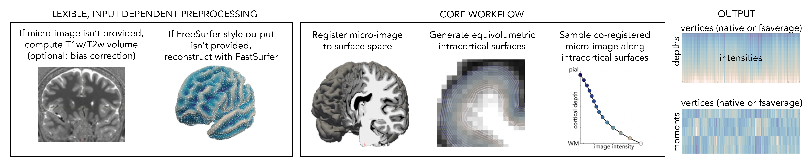

# 🧠 CortPro: You cortical profiling toolbox

**CortPro** is an open-source toolbox for generating and analysing intracortical microstructure profiles. The only prerequisites for microstructure profiling are (i) an MRI suitable for cortical surface reconstruction (e.g. T1w) and (ii) a microstructure-sensitive volume (e.g. qT1, T1w/T2w, MT).

Find out more in our preprint ➡️  [Intracortical microstructure profiling: a versatile method for indexing cortical lamination
](https://www.biorxiv.org/content/10.1101/2025.10.16.682836v1)



---

## Contents
- [Quick start](#quick-start-single-command-run)
- [Command-line options](#command-line-options)
- [Example commands](#example-commands)
- [Outputs](#outputs)
- [Installation](#installation)

---

## 🚀 Quick start (single-command run)

CortPro is designed to run in **one line of code**, and flexibly performs different preprocessing steps depending on the provided input:

```
# Run from the top-level directory of the cloned repository
./microstructure_profiling.sh \
--subject-id sub-001 \
--subjects-dir /path/to/subjects_dir/ \
--output-dir /path/to/output/ \
--fs-dir /path/to/freesurfer/ \
--sing-dir /path/to/singularity/ \
[--micro-image /path/to/micro.nii.gz] \
[--anat-dir /path/to/bids/sub-001/anat/] \
[--t1-file /path/to/T1w.nii.gz --t2-file /path/to/T2w.nii.gz] \
[--ratio-type T2w] \
[--skip-bias-correct] \
[--keep-inter-files] \
[--num-surfaces 14] \
[--surface-output fsaverage5]

#Required Arguments
--subject-id	        Subject identifier (e.g., sub-001)
--subjects-dir	      Path to FreeSurfer-style SUBJECTS_DIR
--output-dir	        Output directory for results
--fs-dir	            Path to FreeSurfer (must contain license.txt)
--sing-dir	          Path to Singularity images (should be the parent directory, that directory must contain micapipe-v0.2.3.simg)

# Optional Arguments
--micro-image FILE    Precomputed microstructure image in native T1 space (e.g. T1w/T2w, qT1). If provided, this option takes precedence over all other microstructure inputs.
--anat-dir DIR        BIDS anat/ directory. Required if no precomputed microstructure image is provided and no custom T1/T2 files are supplied. Also required if cortical surfaces need to be generated.
--t1-file FILE        Custom T1-weighted image. Must be used together with --t2-file.
--t2-file FILE        Custom T2-weighted (or other contrast) image for ratio computation. Must be used together with --t1-file.
--ratio-type NAME     BIDS suffix of the image used for ratio computation with T1w when deriving data from anat-dir (default: T2w).
--skip-bias-correct   Disable bias-field correction during T1w/T2w ratio computation.
--keep-inter-files    Skips final clean up step. Not good for storage but helpful for inspecting data transformations.
--num-surfaces N      Number of intracortical surfaces to generate (default: 14).
--surface-output NAME  Output surface space. Any FreeSurfer fsaverage* surface (default: fsaverage5) or fsnative.
-h, --help            Display help message.
```

---

## 🧬 Example commands

```
# Set arguments
home_dir=/data/group/mune/shortmp/toolbox_test/
module load freesurfer/7.4
fs_dir=/opt/freesurfer/7.4/
sing_dir=/data/project/nspn/singularity/
subject_id=sub-001
anat_dir="$home_dir/A1/$subject_id/anat/"
subjects_dir="$home_dir/A1/fastsurfer/"
output_dir="$home_dir/A1/MP_output/"

cd /data/group/mune/shortmp/microstructure_profiling/

# Case 1: Full run (no preprocessing yet completed)
./microstructure_profiling.sh --anat-dir $anat_dir --subject-id $subject_id --subjects-dir $subjects_dir --output-dir $output_dir --fs-dir $fs_dir --sing-dir $sing_dir

# Case 2: Precomputed micro-image, but no FreeSurfer output available
./microstructure_profiling.sh --micro-image $micro_image --anat-dir $anat_dir --subject-id $subject_id --subjects-dir $subjects_dir --output-dir $output_dir --fs-dir $fs_dir --sing-dir $sing_dir

# Case 3A: FreeSurfer output available, as well as raw T1 and T2 (housed in BIDS anat directory)
./microstructure_profiling.sh --micro-image $micro_image --anat-dir $anat_dir --subject-id $subject_id --subjects-dir $subjects_dir --output-dir $output_dir --fs-dir $fs_dir --sing-dir $sing_dir

# Case 3B: FreeSurfer output available, custom T1 and T2 provided
./microstructure_profiling.sh --t1-file /path/to/T1w.nii.gz --t2-file /path/to/T2w.nii.gz --subject-id $subject_id --subjects-dir $subjects_dir --output-dir $output_dir --fs-dir $fs_dir --sing-dir $sing_dir --skip-bias-correct

# Case 4: Freesurfer output and micro-image both already available
./microstructure_profiling.sh --micro-image $micro_image --subject-id $subject_id --subjects-dir $subjects_dir --output-dir $output_dir --fs-dir $fs_dir --sing-dir $sing_dir

```

---

## Output

The key outputs of the toolbox are two .csv files
- MP: represents changes in intensity down cortical depths (rows = depths, columns = vertices)
- MPmoments: shape characterisation of the profiles based on moments (rows = u0-u4, columns = vertices)

---

## ⚙️ Installation

1. **Clone the repository**:
2. 
```bash
git clone https://github.com/yourorg/CortPro.git
cd CortPro
```

2. **Check dependencies**:
3. 
- **Singularity** installed and available on `$PATH` ([see installation instructions here](https://sylabs.io/guides/latest/user-guide/))
- FreeSurfer with valid `license.txt` ([Download it here](https://surfer.nmr.mgh.harvard.edu/fswiki/DownloadAndInstall))
- Necessary container: [`micapipe-v0.2.3.simg`](https://micapipe.readthedocs.io/en/latest/pages/01.install/index.html)
- Optional container: [`fastsurfer_gpu.sif`](https://deep-mi.org/FastSurfer/dev/overview/singularity.html) (if FreeSurfer output is missing)
