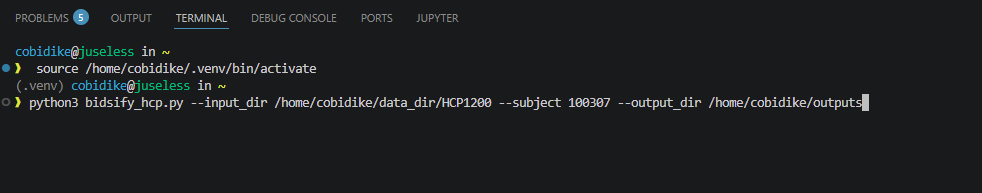
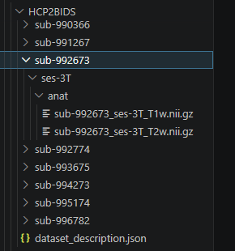
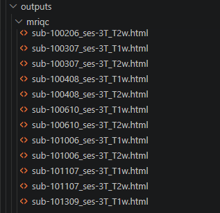
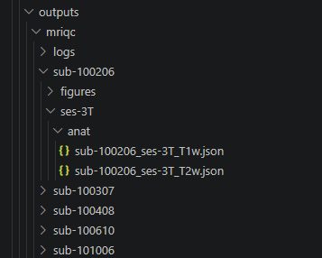
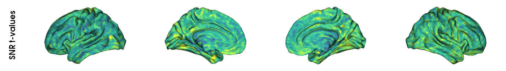

.. _walkthrough:

Data organisation to statistical analysis walkthrough
================================================

A walkthrough of CortPro and investigation of the influence of image quality. This tutorial demonstrates how to combine **CortPro** with `BrainStat <https://brainstat.readthedocs.io/>`_ to statistically evaluate how MR image quality relates to intracortical moments. It walks through the full workflow from data preparation to vertex-wise statistics.
Authored by our wonderful intern, Christine Obidike (thankyou Christine!)

.. contents:: Table of contents
   :local:
   :depth: 2

Data Preparation
----------------

This section consists of four steps:
1. Generate intracortical moments (μ₀, μ₁ and μ₂) using CortPro.
2. Organize the extracted cortical moments into subject × vertex matrices.
3. Convert Human Connectome Project (HCP) structural MRI data to BIDS format.
4. Run MRIQC
5. Extract MRI image quality metrics (SNR, CNR and CJV) using MRIQC.

Generating intracortical moments (μ₀, μ₁ and μ₂) using CortPro.
~~~~~~~~~~~~~~~~~~~~~~~~~~~~~~~~~~~~~~~~~~~~~~~~~~~~~~~~~~~~~~~

CortPro computes the zeroth, first and second intracortical moments. Throughout the remainder of this tutorial these are referred to as:

| μ₀ → MPmean
| μ₁ → MPcog
| μ₂ → MPvar

For group-level statistical analysis, all subjects must share the same cortical mesh. Therefore, this tutorial uses the fsLR32k surface, where each subject contains 64,984 cortical vertices. 

.. code:: bash

    # Set arguments
    fs_dir=$FREESURFER_HOME
    sing_dir=/home/user/singularities/                               # where the cortpro.sif can be found
    subject_id=100206
    subjects_dir="/path/to/HCP1200/${subject_id}/T1w/"               # SUBJECTS_DIR of FreeSurfer output
    output_dir="/data/project/cog_mat/HCP1200/MP_fsLR_32k"           # where the output should be saved

    ./microstructure_profiling.sh --micro-image "$subjects_dir"/T1wDividedByT2w.nii.gz --subject-id $subject_id --subjects-dir $subjects_dir --output-dir $output_dir --fs-dir $fs_dir --sing-dir $sing_dir

Preparing BrainStat input matrices
~~~~~~~~~~~~~~~~~~~~~~~~~~~~~~~~~~

BrainStat expects the cortical measurements to be arranged in a matrix where each row represents one subject and each column represents one cortical vertex. CortPro produces a csv file that contains five cortical moments (μ₀–μ₄) for a single subject. Therefore, the desired moment (e.g., μ₀, μ₁ or μ₂) is first extracted from each subject’s CSV file, after which the selected moment vectors from all subjects are stacked into a single NumPy matrix for statistical analysis.

.. note::

   The example below constructs the matrix for the zeroth cortical moment (μ₀). To generate the matrices for the remaining moments, repeat the same procedure while making the following changes:

   .. list-table::
      :header-rows: 1

      * - Cortical moment
        - Changes required
      * - **μ₀ (MPmean)**
        - ``moment0_rows``, ``moment0_matrix``, ``mpmean``, extract **row 0**
      * - **μ₁ (MPcog)**
        - ``moment1_rows``, ``moment1_matrix``, ``mpcog``, extract **row 1**
      * - **μ₂ (MPvar)**
        - ``moment2_rows``, ``moment2_matrix``, ``mpvar``, extract **row 2**

.. code:: python

   # ============================
   # Imports
   # ============================

   from pathlib import Path

   import numpy as np
   import pandas as pd
   import json

.. code:: python

   # ----------------------------
   # Define input and output directories
   # ----------------------------

   moments_dir = Path("/data/project/cog_mat/HCP1200/MP_fsLR_32k")            # Directory containing the CortPro output (.csv) files
   out_dir = Path("/data/project/cog_mat/christine_hcp/brainstat")            # Directory where the extracted quality metrics CSV will be saved

   # ----------------------------------------
   # Combine subject-specific CortPro output into a single subject × vertex matrix
   # ----------------------------------------

   moment0_rows = []           # Store the cortical moment values for each successfully processed participant
   valid_subjects = []         # Keep track of participants whose CortPro outputs were successfully read
   missing_subjects =[]        # Keep track of participants whose CortPro output files are missing

   for sub in subjects:

       file = moments_dir / f"{sub}_space-fsLR32k_desc-MPmoments.csv"

       if not file.exists():
           print(f"Missing file: {sub}")
           missing_subjects.append(sub)
           continue

       df = pd.read_csv(file, sep=r"\s+", header=None)
        
       # Extract the cortical moment of interest
       mpmean = df.iloc[0, :].to_numpy(dtype=float)     # Row 0 corresponds to μ₀ (MPmean)

       moment0_rows.append(mpmean)
       valid_subjects.append(sub)

   moment0_matrix = np.vstack(moment0_rows)        # Stack all participant vectors into a single subject × vertex matrix

   print("Final matrix shape:", moment0_matrix.shape)

   ## ------------------------------------------
   # Save the matrix for use in BrainStat analyses
   # ------------------------------------------

   np.save(out_dir / "moment0_matrix.npy", moment0_matrix)

   subjects_df = pd.DataFrame({
       "Valid subjects": pd.Series(valid_subjects),
       "Missing subjects": pd.Series(missing_subjects)
   })

   subjects_df.to_csv(out_dir / "subjects_summary.csv", index=False)

Although matrices were generated for all successfully processed participants, only the first 100 participants were used throughout this tutorial to reduce computational time.

.. code:: python

   moment0_matrix = np.load(out_dir / "moment0_matrix.npy")
   moment0_matrix_100 = moment0_matrix[:100, :]  # for the first 100 subjects
   np.save(out_dir / "moment0_matrix_100.npy", moment0_matrix_100)

Converting HCP data to BIDS format
~~~~~~~~~~~~~~~~~~~~~~~~~~~~~~~~~~

The Brain Imaging Data Structure (BIDS) is a standardized format for organizing and describing neuroimaging datasets. Since the Human Connectome Project (HCP) dataset is not in BIDS format, it must first be converted before it can be processed with MRIQC.

.. note::

   The conversion script below is adapted from a solution shared by the NeuroStars community.

.. tip::

   Throughout this tutorial, Visual Studio Code (VS Code) is used as the development environment. Python scripts (``.py``) and Bash scripts (``.sh``) are first saved as files and then executed from the integrated terminal. If you use a different editor, the workflow remains the same provided your editor gives access to a terminal.

Before running the conversion script, create a file named ``dataset_description.json`` and save it in the directory where the BIDS output would be saved.

The contents of the file should be:

.. code:: json

   {
     "Name": "HCP1200 BIDS test",
     "BIDSVersion": "1.8.0",
     "DatasetType": "raw"
   }

Then, save the linked script (https://neurostars.org/t/how-do-you-bids-ify-hcp1200-data/32438/10) as ``bidsify_hcp.py``. Next, open a terminal in the directory containing bidsify_hcp.py and execute:

.. code:: python

   python3 bidsify_hcp.py --input_dir /path/to/HCP1200 \
           --subject 100307 --output_dir /path/to/BIDS_dataset

The command-line arguments have the following meaning:

-  ``--input_dir`` points to the HCP dataset.
-  ``--output_dir`` specifies where the converted BIDS dataset will be written.
-  ``--subject`` is optional. If omitted, the script converts every subject contained in the input directory.

Your terminal should look like this:

If the command completes successfully, the converted BIDS dataset will be written to the directory specified by ``--output_dir``.

Notice that each subject is stored in a ``sub-<ID>`` directory, with the anatomical images located under the ``anat`` subfolder. The ``dataset_description.json`` file is located at the root of the BIDS dataset.

Each subject contains both a T1-weighted (``T1w``) and T2-weighted (``T2w``) structural image. In the next section, MRIQC will use the T1-weighted images to compute the image quality metrics used throughout this tutorial.

Running MRIQC
~~~~~~~~~~~~~

MRIQC is an open-source tool for assessing the quality of MRI images. In this tutorial, MRIQC is executed using a Singularity container to extract three image quality metrics from the T1-weighted structural images: SNR, CNR, and CJV. The singularity container packages all required software and dependencies into a single reproducible environment. This makes it easier to run MRIQC.

   **Prerequisite**

   Before running the script, download an MRIQC Singularity container (e.g. ``mriqc-latest.sif``) and place it in the same directory as the script, or update the script to point to its location. Instructions for obtaining the latest MRIQC container are available in the official MRIQC documentation.

.. code:: python

   #!/bin/bash

   BIDS_DIR=/data  # replace /data with directory for the data e.g BIDS_DIR=~/data_dir/HCP2BIDS
   OUT_DIR=/out    # replace /out with directory for the output e.g OUT_DIR=~/outputs/mriqc 

   SUBJECT=$1

   if [ -z "$SUBJECT" ]; then
       echo "Running MRIQC for ALL subjects"

       singularity exec --cleanenv \
           -B ${BIDS_DIR}:/data \        
           -B ${OUT_DIR}:/out \         
           mriqc-latest.sif \
           mriqc /data /out participant 

   else
       echo "Running MRIQC for subject: $SUBJECT"

       singularity exec --cleanenv \
           -B ${BIDS_DIR}:/data \          
           -B ${OUT_DIR}:/out \            
           mriqc-latest.sif \
           mriqc /data /out participant \
           --participant-label $SUBJECT    
   fi

   # usage
   # no participant:
   # bash run_mriqc.sh
   # with  participant:
   # bash run_mriqc.sh 113215

Save the script as ``run_mriqc.sh``. From the directory containing the script, execute one of the following commands.

.. code:: python

   bash run_mriqc.sh 

OR

.. code:: python

   bash run_mriqc.sh 113215 # specifies a particpant

In addition to HTML quality reports, MRIQC generates a JSON file for every subject containing the computed image quality metrics.

The subject-specific JSON files generated by MRIQC contain the SNR, CNR and CJV values used throughout the remainder of this tutorial. In the last subsection, these values are extracted into a single table for statistical analysis.

Extracting MRIQC quality metrics: SNR, CNR and CJV
~~~~~~~~~~~~~~~~~~~~~~~~~~~~~~~~~~~~~~~~~~~~~~~~~~

The following Python code extracts the SNR, CNR and CJV values from the subject-specific MRIQC JSON files and combines them into a single CSV table. This table serves as the predictor variables for the vertex-wise and subject-level statistical analyses presented in the following sections.

.. code:: python

   # ------------------------------------------
   # Identify all subjects that have CortPro outputs
   # ------------------------------------------

   subjects = sorted({
       f.name.split("_")[0]
       for f in moments_dir.glob("*_space-fsLR32k_desc-MP.csv")
   })

   # ------------------------------------------
   # Read MRIQC JSON files and extract quality metrics
   # ------------------------------------------

   mriqc_metrics_rows = []

   for sub in subjects[:100]:                                                                # Process only the first 100 subjects. Remove [:100] to process all available subjects.
       json_file = mriqc_dir/f"sub-{sub}"/"ses-3T"/"anat"/f"sub-{sub}_ses-3T_T1w.json" 
       with open(json_file, "r") as f:
           iqms = json.load(f)

       snr = iqms["snr_total"]
       cjv = iqms["cjv"]
       cnr = iqms["cnr"]

       mriqc_metrics_rows.append({
           "subject": sub,
           "snr": snr,
           "cjv": cjv,
           "cnr": cnr
       })

   # ------------------------------------------
   # Create a table containing the extracted quality metrics
   # ------------------------------------------

   mriqc_metrics_df = pd.DataFrame(mriqc_metrics_rows)

   print(mriqc_metrics_df)

   # ------------------------------------------
   # Save extracted metrics
   # ------------------------------------------

   mriqc_metrics_df.to_csv(out_dir / "mriqc_metrics_values.csv", index=False) # will contain snr, cjv and cnr values of first 100 subjects

At this stage, the data are ready for statistical analysis. You should now have:

-  CortPro intracortical moments (μ₀, μ₁ and μ₂) in fsLR32k space for each subject.
-  Subject × vertex matrices for each cortical moment (μ₀, μ₁ and μ₂).
-  BIDS-formatted HCP dataset.
-  MRIQC quality metrics (SNR, CNR and CJV) for each subject.
-  A CSV file containing the extracted MRIQC quality metrics.

--------------

Vertex-wise Analysis
--------------------

In this section, we investigate the relationship between MRI image quality metrics and intracortical moments at each cortical vertex using BrainStat’s Surface Linear Model (SLM). The analysis consists of the following steps:

1) Fit a Surface Linear Model (SLM)
2) Generate statistical maps (t-maps and q-maps)

BrainStat fits a separate linear regression model at every cortical vertex. In this tutorial, the predictor variable is an MRI quality metric (SNR, CNR or CJV), while the response variable is the cortical moment (μ₀, μ₁ or μ₂). After fitting the model, BrainStat computes statistical maps indicating where these relationships are significant across the cortical surface.

Fit a Surface Linear Model (SLM)
~~~~~~~~~~~~~~~~~~~~~~~~~~~~~~~~

Load the cortical moment matrix and the MRIQC quality metrics prepared in the previous section.

.. code:: python

   # ============================
   # Imports
   # ============================

   from pathlib import Path

   import numpy as np
   import pandas as pd
   import nibabel as nib

   from brainstat.stats.terms import FixedEffect
   from brainstat.stats.SLM import SLM
   from brainspace.datasets import load_conte69
   from brainspace.plotting import plot_hemispheres
   from brainstat.mesh.data import mesh_smooth
   from brainstat.datasets import fetch_parcellation
   from brainspace.plotting import plot_hemispheres

.. code:: python

   # ============================
   # Set directories
   # ============================
   moments_dir = Path("/data/project/cog_mat/HCP1200/MP_fsLR_32k")            # Directory containing the CortPro output (.csv) files
   mriqc_dir = Path("/data/project/cog_mat/christine_hcp/outputs/mriqc")      # Directory containing the MRIQC output folders and JSON files
   out_dir = Path("/data/project/cog_mat/christine_hcp/brainstat")            # Directory where the extracted quality metrics CSV will be saved
   map_dir = out_dir / "MPmean" / "MPmean_images"                             # Directory where q- and t- maps will be saved
                                                                             
   # ============================
   # Load prepared datasets
   # ============================

   moment0_matrix_100 = np.load(out_dir / "moment0_matrix_100.npy") # for first 100 subjects
   mriqc_metrics_df = pd.read_csv(out_dir/"mriqc_metrics_values.csv")

   snr_values = mriqc_metrics_df["snr"].to_numpy()
   cjv_values = mriqc_metrics_df["cjv"].to_numpy()
   cnr_values = mriqc_metrics_df["cnr"].to_numpy()

The example below fits the SLM using SNR as the predictor variable. The same procedure is repeated for CNR and CJV by replacing the predictor variable.

.. code:: python

   # ============================
   # Fit the Surface Linear Model
   # ============================

   snr = FixedEffect(snr_values, "snr")
   model_snr = snr
   contrast_snr = snr_values

   slm_snr = SLM(
       model_snr,
       contrast_snr,
       correction=["fdr"]
   )

   slm_snr.fit(moment0_matrix_100)

At this point, the Surface Linear Model has been fitted. The model estimates the relationship between MRI image quality and the cortical moment at every surface vertex. In the next step, we visualize these statistical results using t-maps and q-maps.

Generate statistical maps (t-maps and q-maps)
~~~~~~~~~~~~~~~~~~~~~~~~~~~~~~~~~~~~~~~~~~~~~

After fitting the SLM, BrainStat provides two complementary statistical maps:

-  t-maps, which show the strength and direction of the association at every cortical vertex.
-  q-maps, which show only the vertices that remain statistically significant after False Discovery Rate (FDR) correction.

.. code:: python

   # The fitted SLM models are first stored in a dictionary to simplify plotting and subsequent analyses.
   slm_models = {
       "SNR": slm_snr,
       "CNR": slm_cnr,
       "CJV": slm_cjv,
   }

BrainSpace’s conte69 cortical surface (i.e. fs_LR_32k) is used for visualization.

.. code:: python

   pial_left, pial_right = load_conte69()

.. code:: python

   def plot_t_map(metric_name, slm_model, save_dir):
       """
       Plot and save the vertex-wise t-value map for one image quality metric.
       """
       
       filename = save_dir / f"MPmean_tmap_{metric_name}.png"
       
       plot_hemispheres(
           pial_left,
           pial_right,
           slm_model.t,
           color_bar=False,
           color_range=(-4, 4),
           label_text=[f"{metric_name} t-values"],
           cmap="viridis",
           embed_nb=True,
           transparent_bg=True,
           size=(1400, 200),
           zoom=1.45,
           nan_color=(0.7, 0.7, 0.7, 1),
           interactive=False,
           screenshot=True,
           filename=str(filename)
       )

.. code:: python

   def plot_q_map(metric_name, slm_model, save_dir, alpha=0.05):
       """
       Plot and save the FDR-corrected q-value map for one image quality metric.
       Only vertices with q <= alpha are displayed.
       """
       
       qvals = np.copy(slm_model.Q).flatten()
       qvals[qvals > alpha] = np.nan
       
       vals = qvals.reshape(1, -1)
       
       filename = save_dir / f"MPmean_qmap_{metric_name}.png"
       
       plot_hemispheres(
           pial_left,
           pial_right,
           vals,
           color_bar=False,
           color_range=(0, alpha),
           label_text=[f"{metric_name} q-values"],
           cmap="autumn_r",
           embed_nb=True,
           size=(1000, 300),
           zoom=1.5,
           nan_color=(0.7, 0.7, 0.7, 1),
           interactive=False,
           screenshot=True,
           filename=str(filename)
       )
       
       n_sig = np.sum(~np.isnan(qvals))
       percent_sig = n_sig / len(qvals) * 100
       
       print(f"{metric_name}: {n_sig} significant vertices ({percent_sig:.4f}%)")

.. code:: python

   for metric_name, slm_model in slm_models.items():
       plot_t_map(metric_name, slm_model, map_dir)
       plot_q_map(metric_name, slm_model, map_dir)
       

Figure: Vertex-wise t-map showing the association between SNR and μ₀. The colours (Viridis colormap) represent the t-statistic at each cortical vertex, with brighter colours indicating larger positive t-values. The corresponding FDR-corrected q-map indicates the vertices with which a statistically significant association was detected.
